## About the connector

SentinelOne is a cybersecurity platform. SentinelOne unifies prevention, detection, and response in a single platform, enabling organizations to protect their user endpoint devices and critical servers against advanced malware, exploits, and other types of sophisticated threats.

This document provides information about the SentinelOne connector, which facilitates automated interactions, with a SentinelOne server using CyOPs™ playbooks. Add the SentinelOne connector as a step in CyOPs™ playbooks and perform automated operations, such as detecting threats at the endpoints, isolating or shutting down agents.

### Version information

Connector Version: 1.0.0

Compatibility with CyOPs™ Versions: 4.9.0.0-708 and later

Compatibility with SentinelOne Build Number: v2.0.0-EA#115 and later

### Annotations associated with Functions

Annotations are added to functions and functions can be accessed by their annotations from CyOPs™ release 4.10.0 onwards.

| Function                                 | Annotation            | Annotation Category |
| ---------------------------------------- | --------------------- | ------------------- |
| Get Agents                               | list_agents           | Investigation       |
| Agent Action                             | isolate_agent         | Containment         |
| Reconnect Agent Network                  | reconnect_agent       | Remediation         |
| Commission Agent                         | commission_agent      | Remediation         |
| Get Agent Passphrase                     | agent_passphrase      | Miscellaneous       |
| List of Applications Installed on Agents | list_applications     | Investigation       |
| List of Processes Running on Agents      | list_processes        | Investigation       |
| Broadcast Message to Agent               | broadcast_message     | Miscellaneous       |
| Initiate Agent Scan                      | scan_agent            | Investigation       |
| Abort Agent Scan                         | abort_scan            | Investigation       |
| Get Hash Details                         | hash_details          | Investigation       |
| Get Threat Details                       | threat_details        | Investigation       |
| Mitigate Threats                         | mitigate_threats      | Remediation         |
| Mark Threat as Benign                    | mark_threat_as_benign | Remediation         |
| Fetch Agents Logs                        | fetch_logs            | Investigation       |
| Get Agent Count                          | agent_count           | Miscellaneous       |
| List All Threats                         | list_threats          | Investigation       |

## Installing the connector

All connectors provided by  CyOPs™ are delivered using a CyOPs™ repository. Therefore, you must set up your CyOPs™ repository and use the `yum` command to install connectors:

`yum install cyops-connector-sentinelone`

To update a  CyOPs™-provided connector use the following command:

`yum update cyops-connector-sentinelone`

To remove a  CyOPs™-provided connector use the following command:

`yum remove cyops-connector-sentinelone`

The process to write your own custom connector is defined in the `Building a custom connector` topic.

## Prerequisites to configuring the connector

- You must have the URL of the SentinelOne REST endpoint to which you will connect and perform the automated operations and credentials to access that endpoint. 
- To access the CyOPs™ UI, ensure that port 443 is open through the firewall for the CyOPs™ instance.

## Configuring the connector

1. In CyOPs™, on the left pane, click **Connectors**.  
   On the `Connectors` page, you will see the `SentinelOne` connector.
2. Click **Configure** to configure the connector parameters.  
   The configuration parameters that you must provide are the hostname of the SentinelOne endpoint and credentials to access the SentinelOne endpoint.  
   For more information, see the [Configuration parameters](#Configuration-parameters) section.  
   **Note**: You can add multiple configurations if you have more than one SentinelOne server instances in your environment. You must, therefore, specify a unique `Name` to identify each configuration in your environment.  
   If you have previous versions of a connector and you are configuring a newer version of that connector, with the same configuration parameters, then CyOPs™ fetches the configuration and input parameters of the latest available version of that connector. For example, If you have 1.0.0, 1.1.0, and 1.2.0 versions of the SentinelOne connector and you are configuring the 1.3.0 version of the SentinelOne connector, then while configuring the 1.3.0 version,  CyOPs™ will fetch the configuration and input parameters from the 1.2.0 version of the SentinelOne connector. You can review the configuration and input parameters, and then decide to change them or leave them unchanged. 
3. Click **Next**.
4. Choose the actions that you want to enable or disable using the slider in the Status column, **Enabled** or **Disabled**, based on the automated operations you want the SentinelOne connector to perform.
5. Click **Save**.  
   Once you click **Save**, the SentinelOne connector performs a health check, to check the following:  
   Connectivity to the SentinelOne API endpoint.  
   Validity of the credentials provided.  
   If all the details are correct and the SentinelOne server is available then on the `Connectors` page, **Available** is displayed in the `SentinelOne Connector: Configuration Step 1 of 2` dialog.  
   If any or all the details are incorrect or the SentinelOne server is unavailable then on the `Connectors` page, **Disconnected** is displayed in the `SentinelOne Connector: Configuration Step 2 of 2` dialog.     
   You can also click the **Refresh** icon to perform a health check at any time.  

You can view the playbooks bundled with the connector. Refer to the [Included Playbooks](#Included-playbooks) section for details on the bundled playbooks. You can see the bundled playbooks in the **Orchestration and Playbooks** section in  CyOPs™ after importing the SentinelOne connector.

### Configuration parameters

In CyOPs™, on the Connectors page, select the **SentinelOne** connector and click **Configure** to configure the following parameters:

| Parameter  | Description                              |
| ---------- | ---------------------------------------- |
| Host Name  | Host name of the SentinelOne endpoint to which you will connect and perform the automated operations. |
| Username   | Username to access the SentinelOne endpoint for using the API endpoint. |
| Password   | Password to access the SentinelOne endpoint. |
| Verify SSL | Verify SSL connection to the SentinelOne API endpoint.  By default, this option is set as `true`. |

**Note**: You can store the passwords and other confidential data using the `Secrets` store provided in CyOPs™. When you store data in the `Secrets` store, users cannot see that data. However, they can use this data when required. For more information about the `Secrets` store, see *Configuring the Secrets store* in the "Administration" guide.

## Actions supported by the connector

The following automated operations can be included in playbooks:

- Get Agents : Retrieves a list of agents attached to an account.
- Agent Action: Supports actions that can be performed on an agent.  
  You must select **Agent Action** from the **Action** drop-down list and then select one of the following actions from the **Action** drop-down list in the `Inputs` section:   
  Isolate Agent Network: Disconnects an agent from the network.   
  Decommission Agent: Decommissions an agent.  
  Uninstall Agent: Uninstalls agent software from the list of agents.  
  Shutdown Agent: Shutdowns an agent's system.
- Reconnect Agent Network: Reconnects a disconnected agent to the network.
- Commission Agent: Commissions a decommissioned agent.
- Get Agent Passphrase: Retrieves an agent's passphrase to uninstall an offline agent.
- List of Applications Installed on Agents: Retrieves a list of applications installed on an agent.
- List of Processes Running on Agents: Retrieves a list of processes running on an agent.
- Broadcast Message to Agent: Broadcast a message to a specified agent system or a list of agent systems.
- Initiate Agent Scan: Initiates scanning on a specified agent system.
- Abort Agent Scan: Aborts scanning on an agent system.
- Get Hash Details: Retrieve the details for a specified hash.
- Get Threat Details: Retrieves details of a threat.
- Mitigate Threats: Mitigates identified threats in the system.
- Mark Threat as Benign: Marks an identified threat as safe.
- Fetch Agents Logs: Fetches logs from agents system to the SentinelOne cloud.
- Get Agent Count: Retrieves the count of agents on a specified time, filtered by several parameters that you have specified.
- List All Threats: List all threats identified by SentinelOne on agents. You can additionally filter out the results by specifying the agent ID or the threat name.

### operation: Get Agents

#### Input parameters

| Parameter                                | Description                              |
| ---------------------------------------- | ---------------------------------------- |
| Agent Memory Less Than (GB):             | Memory size of the agent is lesser than given input. |
| Agent Memory Greater Than (GB)           | Memory size of the agent is greater than given input. |
| Agent Core Count Less Than               | Core count of agents is lesser than given input. |
| Agent Core Count Greater Than            | Core count of agents is greater than given input. |
| Active Status                            | Active status of the agent.              |
| Infected Status                          | Infected status of the agent.            |
| Include Decommissioned                   | Include decommissioned status.           |
| Is Decommissioned                        | Is the current state decommissioned.     |
| Agent ID's (comma-separated list)        | List of comma-separated agent ids.       |
| Exclude Agent ID's (comma-separated list) | List of comma-separated agent ids that are to be excluded. |
| Computer Name Like                       | Agent that matches the specified name.   |
| Agent Version                            | Version of the agent.                    |
| Skip Records                             | Skips the specified number of results from the total results. |
| Limit Records                            | Limits the results to the specified number. |
| Network Status                           | Current network status of the agent.     |

#### Output

The JSON output contains a list of agents that are being monitored by the central account.

Following image displays a sample output:

### operation: Agent Action

#### Input parameters

| Parameter                         | Description                              |
| --------------------------------- | ---------------------------------------- |
| Action                            | Action to be performed.    You can choose between the following actions: Isolate Agent Network, Decommission Agent, Uninstall Agent, or Shutdown Agent. |
| Agent ID's (comma-separated list) | ID of the agents separated by commas.    |
| Group Id's (comma separated list) | ID of the agents groups separated by commas. |
| Is Decommissioned                 | Agents' decommissioned status.           |
| Is Unistalled                     | Agents' uninstall status.                |

#### Output

If you select **Isolate Agent Network** as the input action then the JSON output contains the number of agents that get isolated after the query is successfully run.

Following image displays a sample output:

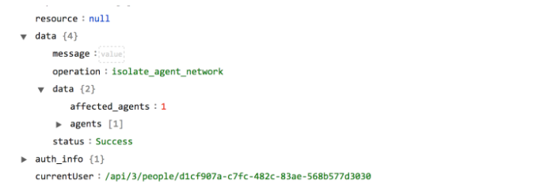

If you select **Decommission Agent** as the input action then the JSON output contains the number of users that are decommissioned after the query is successfully run.

Following image displays a sample output:

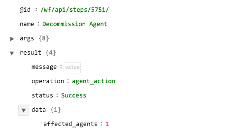

If you select **Uninstall Agent** as the input action then the JSON output contains the number of agents that are uninstalled after the query is successfully run.

Following image displays a sample output:

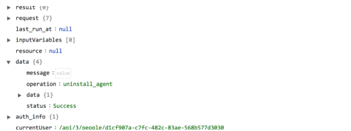

If you select **Shutdown Agent** as the input action then the JSON output contains the number of agents that are affected by the shutdown operation after the query is successfully run.

Following image displays a sample output:

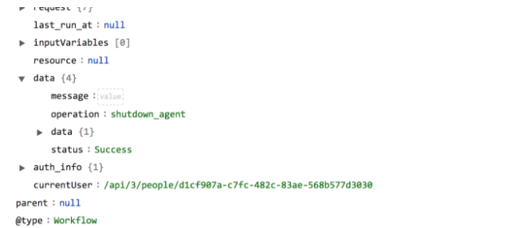

### operation: Reconnect Agent Network

#### Input parameters

| Parameter                                | Description                              |
| ---------------------------------------- | ---------------------------------------- |
| Agent Memory Less Than (GB):             | Memory size of the agent is lesser than given input. |
| Agent Memory Greater Than (GB)           | Memory size of the agent is greater than given input. |
| Agent Core Count Less Than               | Core count of agents is lesser than given input. |
| Agent Core Count Greater Than            | Core count of agents is greater than given input. |
| Active Status                            | Active status of the agent.              |
| Infected Status                          | Infected status of the agent.            |
| Include Decommissioned                   | Include decommissioned status.           |
| Is Decommissioned                        | Is the current state decommissioned.     |
| Agent ID's (comma-separated list)        | List of comma-separated agent ids.       |
| Exclude Agent ID's (comma-separated list) | List of comma-separated agent ids that are to be excluded. |
| Computer Name Like                       | Agent that matches the specified name.   |
| Agent Version                            | Version of the agent.                    |
| OS Type                                  | Type of the OS used by the agent.        |
| Skip Records                             | Skips the specified number of results from the total results. |
| Limit Records                            | Limits the results to the specified number. |
| Network Status                           | Current network status of the agent.     |

#### Output

The JSON contains a `Success` message of agents reconnected back into the network.

Following image displays a sample output:

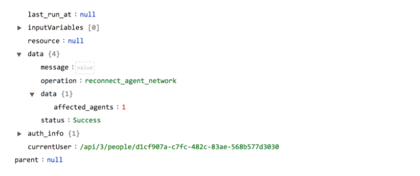

### operation: Commission Agent

#### Input parameters

| Parameter | Description                              |
| --------- | ---------------------------------------- |
| Agent Id  | ID of the agent you want to recommission. |

#### Output

The JSON contains a `Success` message of  the commissioning of the specified agent, or an `Error` message containing the reason for failure if the commissioning is not successful.

Following image displays a sample output:

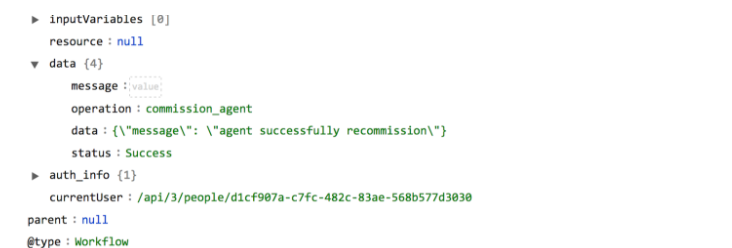

### operation: Get Agent Passphrase

#### Input parameters

| Parameter | Description                              |
| --------- | ---------------------------------------- |
| Agent Id  | ID of the agent whose passphrase who want to retrieve. |

#### Output

The JSON contains a string output with the passphrase that can be used to delete an offline agent.

Following image displays a sample output:

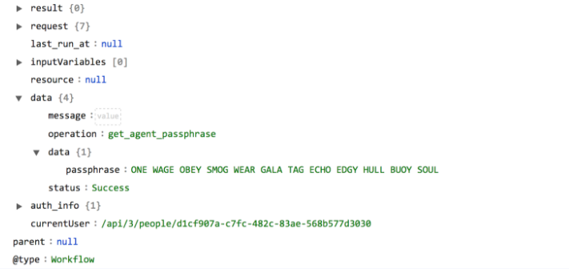

### operation: List of Applications Installed on Agents

#### Input parameters

| Parameter | Description                              |
| --------- | ---------------------------------------- |
| Agent Id  | ID of the agent for which you want to retrieve the list of installed applications. |

#### Output

The JSON contains a list of application objects including information such as name, installation date, about the applications installed on the specified agent.

Following image displays a sample output:

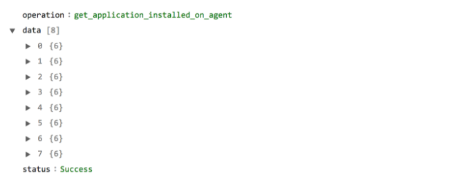

### operation: List of Processes Running on Agents

#### Input parameters

| Parameter | Description                              |
| --------- | ---------------------------------------- |
| Agent Id  | ID of the agent for which you want to retrieve the list of running processes. |

#### Output

The JSON contains a list of running processes along with the process details for the specified agent.

Following image displays a sample output:

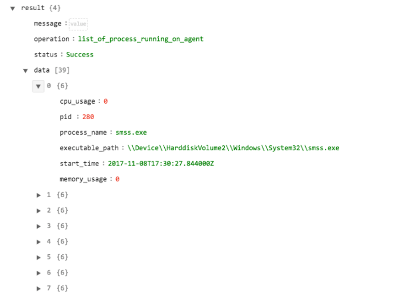

### operation: Broadcast Message to Agent

#### Input parameters

| Parameter                                | Description                              |
| ---------------------------------------- | ---------------------------------------- |
| Message                                  | Message that you want to broadcast to an agent or a list of agents. |
| Agent Memory Less Than (GB):             | Memory size of the agent is lesser than given input. |
| Agent Memory Greater Than (GB)           | Memory size of the agent is greater than given input. |
| Agent Core Count Less Than               | Core count of agents is lesser than given input. |
| Agent Core Count Greater Than            | Core count of agents is greater than given input. |
| Active Status                            | Active status of the agent.              |
| Infected Status                          | Infected status of the agent.            |
| Include Decommissioned                   | Include decommissioned status.           |
| Is Decommissioned                        | Is the current state decommissioned.     |
| Agent ID's (comma-separated list)        | List of comma-separated agent ids.       |
| Exclude Agent ID's (comma-separated list) | List of comma-separated agent ids that are to be excluded. |
| Computer Name Like                       | Agent that matches the specified name.   |
| Agent Version                            | Version of the agent.                    |
| OS Type                                  | Type of the OS used by the agent.        |
| Skip Records                             | Skips the specified number of results from the total results. |
| Limit Records                            | Limits the results to the specified number. |
| Network Status                           | Current network status of the agent.     |

#### Output

The JSON output contains the number of agents that are affected by the broadcast operation after the query is successfully run.

Following image displays a sample output:

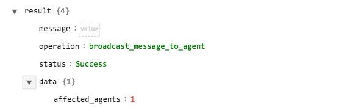

### operation: Initiate Agent Scan

#### Input parameters

| Parameter                                | Description                              |
| ---------------------------------------- | ---------------------------------------- |
| Agent Memory Less Than (GB):             | Memory size of the agent is lesser than given input. |
| Agent Memory Greater Than (GB)           | Memory size of the agent is greater than given input. |
| Agent Core Count Less Than               | Core count of agents is lesser than given input. |
| Agent Core Count Greater Than            | Core count of agents is greater than given input. |
| Active Status                            | Active status of the agent.              |
| Infected Status                          | Infected status of the agent.            |
| Include Decommissioned                   | Include decommissioned status.           |
| Is Decommissioned                        | Is the current state decommissioned.     |
| Agent ID's (comma-separated list)        | List of comma-separated agent ids.       |
| Exclude Agent ID's (comma-separated list) | List of comma-separated agent ids that are to be excluded. |
| Computer Name Like                       | Agent that matches the specified name.   |
| Agent Version                            | Version of the agent.                    |
| OS Type                                  | Type of the OS used by the agent.        |
| Skip Records                             | Skips the specified number of results from the total results. |
| Limit Records                            | Limits the results to the specified number. |
| Network Status                           | Current network status of the agent.     |

#### Output

The JSON output contains the number of agents that are affected by the scan operation after the query is successfully run.

Following image displays a sample output:

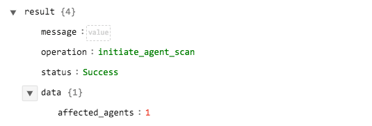

### operation: Abort Agent Scan

#### Input parameters

| Parameter                                | Description                              |
| ---------------------------------------- | ---------------------------------------- |
| Agent Memory Less Than (GB):             | Memory size of the agent is lesser than given input. |
| Agent Memory Greater Than (GB)           | Memory size of the agent is greater than given input. |
| Agent Core Count Less Than               | Core count of agents is lesser than given input. |
| Agent Core Count Greater Than            | Core count of agents is greater than given input. |
| Active Status                            | Active status of the agent.              |
| Infected Status                          | Infected status of the agent.            |
| Include Decommissioned                   | Include decommissioned status.           |
| Is Decommissioned                        | Is the current state decommissioned.     |
| Agent ID's (comma-separated list)        | List of comma-separated agent ids.       |
| Exclude Agent ID's (comma-separated list) | List of comma-separated agent ids that are to be excluded. |
| Computer Name Like                       | Agent that matches the specified name.   |
| Agent Version                            | Version of the agent.                    |
| OS Type                                  | Type of the OS used by the agent.        |
| Skip Records                             | Skips the specified number of results from the total results. |
| Limit Records                            | Limits the results to the specified number. |
| Network Status                           | Current network status of the agent.     |

#### Output

The JSON output contains the number of agents that are affected by the abort scan operation after the query is successfully run.

Following image displays a sample output:

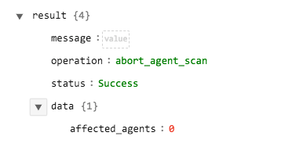

### operation: Get Hash Details

#### Input parameters

| Parameter | Description                              |
| --------- | ---------------------------------------- |
| Hash Id   | Hash ID (sha1 only) of the agent for which you want to retrieve details. |

#### Output

The JSON contains the details of the specified hash ID.

Following image displays a sample output:

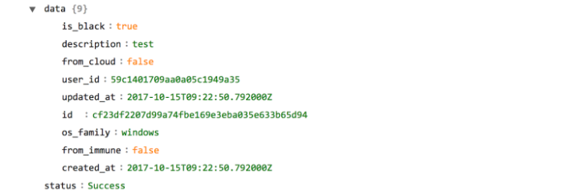

### operation: Get Threat Details

#### Input parameters

| Parameter | Description                              |
| --------- | ---------------------------------------- |
| Threat Id | ID of the threat for which you want to retrieve details. |

#### Output

The JSON contains the details of the specified threat ID.

Following image displays a sample output:

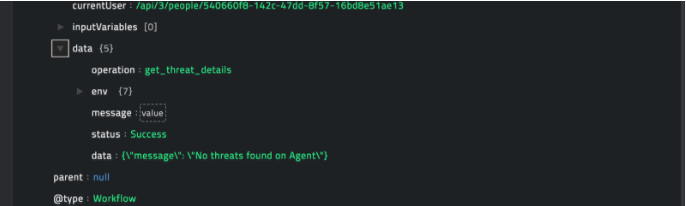

### operation: Mitigate Threats

#### Input parameters

| Parameter     | Description                              |
| ------------- | ---------------------------------------- |
| Action        | Action to be taken on the threat.   You can choose between the following actions: Kill, Quarantine, Un-Quarantine, Remediate, or Rollback-Remediation. |
| Threat Id     | ID of the threat on which the action needs to be taken. |
| Content Hash  | Hash ID of the file associated with the threat. |
| Threat Name   | Name of the threat that requires mitigation. |
| Agent Id      | ID of the agent on which the threat has been identified. |
| Skip Records  | Skips the specified number of results from the total results. |
| Limit Records | Limits the results to the specified number. |
| From Scan     | Whether the threat was detected as a result of a scan. |
| Is Hidden     | Whether the threat is hidden.            |

#### Output

The JSON contains a message about the threat being mitigated.

Following image displays a sample output:

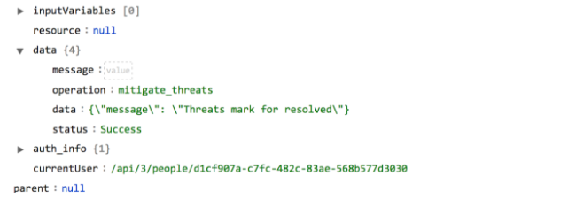

### operation: Mark Threat as Benign

#### Input parameters

| Parameter     | Description                              |
| ------------- | ---------------------------------------- |
| Threat Id     | ID of the threat that requires to be marked as safe. |
| Content Hash  | Hash ID of the file associated with the threat. |
| Threat Name   | Name of the threat that requires to be marked as safe. |
| Agent Id      | ID of the agent on which the threat had been identified. |
| Skip Records  | Skips the specified number of results from the total results. |
| Limit Records | Limits the results to the specified number. |
| From Scan     | Whether the threat was detected as a result of a scan. |
| Is Hidden     | Whether the threat is hidden.            |

#### Output

The JSON contains a message about the threat being marked as safe.

Following image displays a sample output:

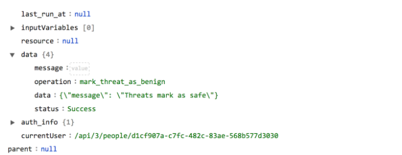

### operation: Fetch Agents Logs

#### Input parameters

| Parameter                                | Description                              |
| ---------------------------------------- | ---------------------------------------- |
| Agent Memory Less Than (GB):             | Memory size of the agent is lesser than given input. |
| Agent Memory Greater Than (GB)           | Memory size of the agent is greater than given input. |
| Agent Core Count Less Than               | Core count of agents is lesser than given input. |
| Agent Core Count Greater Than            | Core count of agents is greater than given input. |
| Active Status                            | Active status of the agent.              |
| Infected Status                          | Infected status of the agent.            |
| Include Decommissioned                   | Include decommissioned status.           |
| Is Decommissioned                        | Is the current state decommissioned.     |
| Agent ID's (comma-separated list)        | List of comma-separated agent ids.       |
| Exclude Agent ID's (comma-separated list) | List of comma-separated agent ids that are to be excluded. |
| Computer Name Like                       | Agent that matches the specified name.   |
| Agent Version                            | Version of the agent.                    |
| OS Type                                  | Type of the OS used by the agent.        |
| Skip Records                             | Skips the specified number of results from the total results. |
| Limit Records                            | Limits the results to the specified number. |
| Network Status                           | Current network status of the agent.     |

#### Output

The JSON output contains the number of agents whose logs are fetched after the query is successfully run.

Following image displays a sample output:

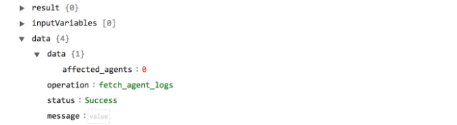

### operation: Get Agent Count

#### Input parameters

| Parameter                                | Description                              |
| ---------------------------------------- | ---------------------------------------- |
| Agent Memory Less Than (GB):             | Memory size of the agent is lesser than given input. |
| Agent Memory Greater Than (GB)           | Memory size of the agent is greater than given input. |
| Agent Core Count Less Than               | Core count of agents is lesser than given input. |
| Agent Core Count Greater Than            | Core count of agents is greater than given input. |
| Active Status                            | Active status of the agent.              |
| Infected Status                          | Infected status of the agent.            |
| Include Decommissioned                   | Include decommissioned status.           |
| Is Decommissioned                        | Is the current state decommissioned.     |
| Agent ID's (comma-separated list)        | List of comma-separated agent ids.       |
| Exclude Agent ID's (comma-separated list) | List of comma-separated agent ids that are to be excluded. |
| Computer Name Like                       | Agent that matches the specified name.   |
| Agent Version                            | Version of the agent.                    |
| OS Type                                  | Type of the OS used by the agent.        |
| Skip Records                             | Skips the specified number of results from the total results. |
| Limit Records                            | Limits the results to the specified number. |
| Network Status                           | Current network status of the agent.     |

#### Output

The JSON output contains the number of available agents.

Following image displays a sample output:

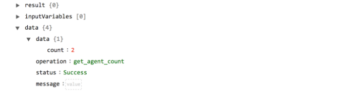

### operation: List All Threats

#### Input parameters

| Parameter     | Description                              |
| ------------- | ---------------------------------------- |
| Content Hash  | Hash ID of the file associated with the threat. |
| Threat Name   | Name of the threat that you want to search for on all agents. |
| Agent Id      | ID of the agent for which you want to list all the threats. |
| Skip Records  | Skips the specified number of results from the total results. |
| Limit Records | Limits the results to the specified number. |
| From Scan     | Whether the threat was detected as a result of a scan. |
| Is Hidden     | Whether the threat is hidden.            |

#### Output

The JSON contains the objects of the threats that are found after the query is successfully run.

Following image displays a sample output:

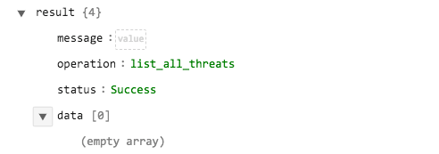

## Included playbooks

The Connector Playbook for SentinelOne comes bundled with the SentinelOne connector. This playbook contains steps using which you can perform all supported actions. You can see the bundled playbooks in the **Orchestration and Playbooks** section in  CyOPs™ after importing the SentinelOne connector.

- Abort Agent Scan
- Broadcast Message to Agent
- Decommission Agent
- Fetch Agent Logs
- Get Agent Count
- Get Agent Passphrase
- Get Agents
- Get Hash Details
- Get Threat Details
- Initiate Agent Scan
- Isolate Agent Network
- List All Threat
- List of Applications Installed on Agents
- List of Processes Running on Agents
- Mark Threat as Benign
- Mitigate Threat
- Commission Agent
- Reconnect Agent Network
- Shutdown Agent
- Uninstall Agent

## Troubleshooting

### Connection refusal while requesting to run the wrapper

This generally occurs in the case of self-signed SSL certificates. If you are using self-signed certificates for testing or staging, keep in mind this problem will not occur in production and you might need to switch the certificates on or off.

**Resolution**:

Ensure that the SSL certificates are trusted or that SSL checking is turned off in the wrapper script. *This is not advised for production instances.*

### Playbook fails after the ingestion is triggered

There are many reasons for a playbook failure, for example, if a required field is `null` in the target module record, or there are problems with the Playbook Appliance keys.

**Resolution**:

Investigate the reason for failure using the **Running Playbooks** tab in the `Playbook Administration` page. Review the step in which the failure is being generated and the result of the step, which should contain the trace of the error. Once you have identified the error and if you cannot troubleshoot the error, contact CyberSponse support for further assistance.  